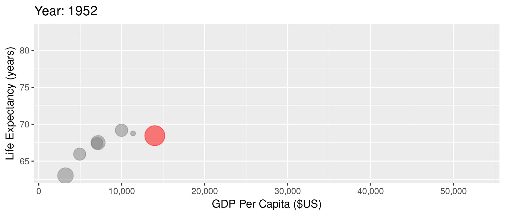

<!-- Adjust some CSS code for font size and maintain R code font size -->
<style type="text/css">
.remark-slide-content {
    font-size: 30px;
    padding: 1em 2em 1em 2em;    
}
.remark-code, .remark-inline-code { 
    font-size: 20px;
}
</style>


<!-- Set R options for how code chunks are displayed and load packages -->
```{r setup, include=FALSE}
options(htmltools.dir.version = FALSE)
library(knitr)
opts_chunk$set(
  fig.align="center",  
  fig.height=3, #fig.width=6,
  # out.width="748px", #out.length="520.75px",
  dpi=300, #fig.path='Figs/',
  cache=T#, echo=F, warning=F, message=F
  )

knitr::opts_hooks$set(fig.callout = function(options) {
  if(options$fig.callout) {
    options$echo = FALSE
  }
  options
})

if (!require("pacman")) install.packages("pacman")
pacman::p_load(tidyverse, ggplot2, dplyr, lubridate, readr, readxl, hrbrthemes,
               scales, gganimate, gapminder, gifski, png, tufte, plotly, OECD,
               ggrepel, here)
```

```{r xaringan-scribble, echo=FALSE}
xaringanExtra::use_scribble(rgb(0.9, 0.5, 0.5))
```


# Outline

1. [Motivation](#welcome)

2. [Class Details](#syllabus)


<!-- New Section -->
---
class: inverse, center, middle
name: welcome

# Motivation

<html><div style='float:left'></div><hr color='#EB811B' size=1px width=1055px></html>


---
# Health improvements

```{r life-exp, echo=FALSE}
library(gapminder)
gapminder %>%
  group_by(year) %>%
  summarize(lifeExp = median(lifeExp),
            gdpMed = median(gdpPercap)) %>%
  ggplot(aes(year,lifeExp)) + geom_line(alpha = 1/3) + theme_bw() +
    labs(x = "Year",
         y = "Life Expectancy (years)",
         title = "Median life expectancy across the world")

```


---
# Some health gains from economic growth

```{r lifexp-gdp, echo=FALSE}
library(gapminder)
ggplot(data = gapminder, mapping = aes(x = gdpPercap, y = lifeExp)) + 
  geom_point(size = 1) + theme_bw() + scale_x_continuous(label = comma) +
  labs(x = "GDP Per Capita ($US)",
       y = "Life Expectancy (years)",
       title = "Life expectancy and GDP")
```

---
# But the US is unique

```{r us-gap, message=FALSE, warning=FALSE, include=FALSE}
mycolors <- c("US" = "red", "other" = "grey50")
anim1 <- gapminder %>% filter(country %in% c("Canada", "France", "Germany", "Italy", "Japan", "United Kingdom", "United States")) %>%
  mutate(highlight = ifelse(country=="United States", "US", "other")) %>%
  ggplot(aes(gdpPercap, lifeExp, size = pop)) +
  geom_point(alpha = 0.5, show.legend = FALSE, aes(color=highlight)) +
  scale_color_manual("U.S.", values = mycolors) +
  scale_size(range = c(2, 12)) +
  scale_x_comma(limits=c(0,55000)) + 
  labs(title = 'Year: {frame_time}', x = 'GDP Per Capita ($US)', y = 'Life Expectancy (years)') +
  transition_time(year) +
  ease_aes('linear')

anim_save("anim1.gif",anim1,
          path="pics")
```

.center[
  
]

---
# Very high spending

.center[
  
]


---
# Spending and infant mortality

.center[
  
]


---
# Spending and maternal mortality

.center[
  
]


---
# Why study healthcare

1. Health and healthcare are constantly changing

2. <span>&#36;</span>3.5 trillion, 17.9% of GDP, <span>&#36;</span>10,739 per person

3. Coronavirus shows interconnected web of economics, health policy, public policy, public health

4. U.S. healthcare is uniquely inefficient in many ways


---
# Economic issues in healthcare

Lots of interesting economic issues in healthcare (not all unique to the U.S.):

1. Extremely heterogeneous products

2. Asymmetric information between patients and physicians

3. Unobservable quality (experience good)

4. Unpredictable need (inability to shop in many cases)

5. Distortion of incentives due to insurance

6. Adverse selection (asymmetric information between patients and insurers)


---
class: clear, middle

**What does all this complexity mean?**

---
# 1. Too many uninsured

```{r echo=FALSE, out.width="700px"}
knitr::include_graphics("pics/kff-uninsured.png")
```

---
# 2. Really high prices

```{r echo=FALSE, out.width="700px"}
knitr::include_graphics("pics/price-comparison.png")
```

---
# 2. Really high prices

```{r echo=FALSE, out.width="700px"}
knitr::include_graphics("pics/price-compare2.png")
```

---
# 2. Really high prices

```{r echo=FALSE, out.width="700px"}
knitr::include_graphics("pics/price-compare3.png")
```


---
# 2. Really high prices

```{r echo=FALSE, out.width="700px"}
knitr::include_graphics("pics/price-compare4.png")
```


---
# 2. Really high prices

```{r echo=FALSE, out.width="700px"}
knitr::include_graphics("pics/price-compare6.png")
```


---
# 3. Variation in quantity


.pull-left[
```{r echo=FALSE, out.width="400px"}
knitr::include_graphics("pics/dartmouth_map.png")
```
]


.pull-right[
```{r echo=FALSE, out.width="400px"}
knitr::include_graphics("pics/dartmouth_dist.png")
```
]


---
# 4. Variation in prices

Some variation due to different "prices" for different people

- Negotiation with private insurers (bargaining problem)
- Set payment from Medicare and Medicaid
  - Medicaid managed care (80%)
  - Medicare Advantage (45%)
- Uninsured patients (charge amounts)

--

.center[
Price $\neq$ charge $\neq$ cost $\neq$ patient out-of-pocket spending
]


---
# 4. Variation in prices

```{r echo=FALSE, out.width="650px"}
knitr::include_graphics("pics/DifferentPrices.jpg")
```


<div class="smalltext">Source: <a href="https://healthcarepricingproject.org/">Health Care Pricing Project</a></div>


---
# 4. Variation in prices


.pull-left[
```{r echo=FALSE, out.width="400px"}
knitr::include_graphics("pics/HC_var_withinmkt_hip_ga_atlanta.png")
```
]

.pull-right[
```{r echo=FALSE, out.width="400px"}
knitr::include_graphics("pics/HC_var_withinmkt_kmri_ga_atlanta.png")
```
]

<div class="smalltext">Source: <a href="https://healthcarepricingproject.org/">Health Care Pricing Project</a></div>


---
# 5. Crazy billing practices

```{r echo=FALSE, out.width="700px"}
knitr::include_graphics("pics/surprise-ed.png")
```


---
# 5. Crazy billing practices

```{r echo=FALSE, out.width="700px"}
knitr::include_graphics("pics/surprise-ip.png")
```


<!-- New Section -->
---
class: inverse, center, middle
name: syllabus

# Syllabus highlights

<html><div style='float:left'></div><hr color='#EB811B' size=1px width=1055px></html>

(Read the full document [here](https://econ771f22.classes.ianmccarthyecon.com/syllabus/syllabus-771.pdf))


---
# What about this class specifically?

1. Overlap with industrial organization and healthcare

2. Data challenges and opportunities

3. Good blend of microeconomic theory and applied empirical micro


---
# Structure

- *Substantive* areas

  - Hospital ownership and production
  
  - Physician agency
  
  - Information disclosure and choice
  
  - Competition and industrial organization


---
# Structure

- *Applying* canonical methods for causal inference
  
  - Difference-in-differences  
  
  - Instrumental variables
  
  - Regression discontinuity
  


---
# Structure

- *Datasets* from the real world

  - Hospital Cost Report Information System (HCRIS)
  
  - Inpatient Prospective Payment System (IPPS) Final Rule Files
  
  - Provider of Services (POS) files
  
  - Provider Utilization and Payment Public Use Files (PUF)
  
  - Medicare Advantage Insurance Data
  
---
# Structure

- Best practices for *workflow*

  - Version control with Git and GitHub
  
  - Extracting and managing raw data
  
  - Replicable and organized workflow
  
  
---
# Assignments

- Empirical exercises (x4)

- Presentation (x3)

- Lit review or draft paper

- Discussion/participation

---
# Grading

| Component                           | Weight |
|:-|-:|
| Discussion/participation            | 10% |
| 4 × empirical exercises (10% each)  | 40% |
| 3 x presentations (10% each)        | 30% |
| Lit review/draft paper              | 20% |

