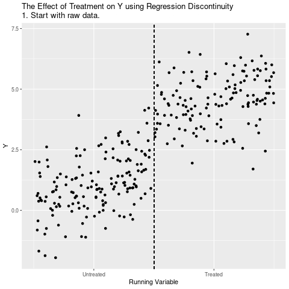

class: inverse, center, middle


<!-- Adjust some CSS code for font size and maintain R code font size -->
<style type="text/css">
.remark-slide-content {
    font-size: 30px;
    padding: 1em 2em 1em 2em;    
}
.remark-code {
  font-size: 15px;
}
.remark-inline-code { 
    font-size: 20px;
}
</style>


<!-- Set R options for how code chunks are displayed and load packages -->
```{r setup, include=FALSE}
options(htmltools.dir.version = FALSE)
library(knitr)
knitr::opts_chunk$set(
  fig.align="center",  
  fig.height=3, #fig.width=6,
  # out.width="748px", #out.length="520.75px",
  dpi=300, #fig.path='Figs/',
  cache=T,# echo=F, warning=F, message=F
  warning = FALSE, 
  message = FALSE, 
  cache.lazy = FALSE,
  error=TRUE
  )

knitr::opts_hooks$set(fig.callout = function(options) {
  if(options$fig.callout) {
    options$echo = FALSE
  }
  options
})

if (!require("pacman")) install.packages("pacman")
pacman::p_load(tidyverse, ggplot2, dplyr, lubridate, readr, readxl, fixest, readstata13,
               xaringanExtra, rdrobust, ggthemes, gganimate, plotly, here, hrbrthemes,
               scales, gapminder, gifski, png, tufte, OECD, ggrepel, dtplyr, data.table, kableExtra, 
               cobalt, haven, magick)
set.seed(1234)
```

```{r xaringan-scribble, echo=FALSE}
xaringanExtra::use_scribble(rgb(0.9, 0.5, 0.5))
```


# The Basics

<html><div style='float:left'></div><hr color='#EB811B' size=1px width=1055px></html>

---
# The Idea

Key intuition from RD:<br>

--
<br>

Observations are <b>identical</b> just above/below threshold

---
# The Idea

Highly relevant in "rule-based" world...
- School eligibility based on age cutoffs
- Program participation based on discrete income thresholds
- Performance scores rounded to nearest integer

---
# Required elements

1. Score
2. Cutoff
3. Treatment

---
# Types of RD
1. Sharp regression discontinuity
  - those above the threshold guaranteed to participate<br>

--
<br>
2. Fuzzy regression discontinuity
  - those above the threshold are eligible but may not participate


<!-- New Section -->
---
class: inverse, center, middle

# Sharp RD

<html><div style='float:left'></div><hr color='#EB811B' size=1px width=1055px></html>


---
class: clear


$$D_{i} = 1(x_{i}>c) = \begin{cases}
    1 & \text{if} & x_{i}>c \\
    0 & \text{if} & x_{i}<c 
\end{cases}$$

<br>
- $x$ is "forcing variable"
- $c$ is the threshold value or cutoff point

---
# Sharp RD Scatterplot
```{r rd-plot1, echo=FALSE}
n=1000
rd.dat <- tibble(
  X = runif(n,0,2),
  W = (X>1),
  Y = 0.5 + 2*X + 4*W + -2.5*W*X + rnorm(n,0,.5)
)
plot1 <- rd.dat %>% ggplot(aes(x=X,y=Y)) + 
  geom_point() + theme_bw() +
  geom_vline(aes(xintercept=1),linetype='dashed') +
  scale_x_continuous(
    breaks = c(.5, 1.5),
    label = c("Untreated", "Treated")
  ) +
  xlab("Running Variable") + ylab("Outcome")
plot1
```

---
# Sharp RD Linear Predictions
```{r rd-plot2, echo=FALSE}
plot2 <- plot1 +
  geom_smooth(method = 'lm', data = (rd.dat %>% filter(W == TRUE)) ) +
  geom_smooth(method = 'lm', data = (rd.dat %>% filter(W == FALSE)) )
plot2
```


---
# Sharp RD Linear Predictions
```{r rd-plot3, echo=FALSE}
plot3 <- plot2 +
  stat_smooth(method = 'lm', data = (rd.dat %>% filter(W == TRUE)), fullrange = TRUE, linetype = 'dashed') +
  stat_smooth(method = 'lm', data = (rd.dat %>% filter(W == FALSE)), fullrange = TRUE, linetype = 'dashed')
plot3
```


---
# Different averages
```{r calcs, include=FALSE}
mean.0 <- rd.dat %>% filter(X>0.8 & W == FALSE) %>% summarize(mean=mean(Y))
mean.1 <- rd.dat %>% filter(X<1.2 & W == TRUE) %>% summarize(mean=mean(Y))
mean.0.all <- rd.dat %>% filter(W == FALSE) %>% summarize(mean=mean(Y))
mean.1.all <- rd.dat %>% filter(W == TRUE) %>% summarize(mean=mean(Y))
```
- Mean difference around threshold of 0.2, `r round(mean.1,2)` - `r round(mean.0,2)` = `r round(mean.1-mean.0,2)`
- Mean overall difference, `r round(mean.1.all,2)` - `r round(mean.0.all,2)` = `r round(mean.1.all-mean.0.all,2)`


---
# More generally
- Running variable may affect outcome directly
- Focusing on area around cutoff does two things:<br>

--
<br>
  1. Controls for running variable
  2. "Controls" for unobserved things correlated with running variable and outcome

---
# Animations!
```{r animate, message=FALSE, warning=FALSE, include=FALSE}
df <- data.frame(xaxisTime=runif(300)*20) %>%
  mutate(Y = .2*xaxisTime+3*(xaxisTime>10)-.1*xaxisTime*(xaxisTime>10)+rnorm(300),
         state="1",
         groupX=floor(xaxisTime)+.5,
         groupLine=floor(xaxisTime),
         cutLine=rep(c(9,11),150)) %>%
  group_by(groupX) %>%
  mutate(mean_Y=mean(Y)) %>%
  ungroup() %>%
  arrange(groupX)


dffull <- rbind(
  #Step 1: Raw data only
  df %>% mutate(groupLine=NA,cutLine=NA,mean_Y=NA,state='1. Start with raw data.'),
  #Step 2: Add Y-lines
  df %>% mutate(cutLine=NA,state='2. Figure out what differences in Y are explained by the Running Variable.'),
  #Step 3: Collapse to means
  df %>% mutate(Y = mean_Y,state="3. Keep only what's explained by the Running Variable."),
  #Step 4: Zoom in on just the cutoff
  df %>% mutate(mean_Y = ifelse(xaxisTime > 9 & xaxisTime < 11,mean_Y,NA),Y=ifelse(xaxisTime > 9 & xaxisTime < 11,mean_Y,NA),groupLine=NA,state="4. Focus just on what happens around the cutoff."),
  #Step 5: Show the effect
  df %>% mutate(mean_Y = ifelse(xaxisTime > 9 & xaxisTime < 11,mean_Y,NA),Y=ifelse(xaxisTime > 9 & xaxisTime < 11,mean_Y,NA),groupLine=NA,state="5. The jump at the cutoff is the effect of treatment."))


p <- ggplot(dffull,aes(y=Y,x=xaxisTime))+geom_point()+
  geom_vline(aes(xintercept=10),linetype='dashed')+
  geom_point(aes(y=mean_Y,x=groupX),color="red",size=2)+
  geom_vline(aes(xintercept=groupLine))+
  geom_vline(aes(xintercept=cutLine))+
  geom_segment(aes(x=10,xend=10,
                   y=ifelse(state=='5. The jump at the cutoff is the effect of treatment.',
                            filter(df,groupLine==9)$mean_Y[1],NA),
                   yend=filter(df,groupLine==10)$mean_Y[1]),size=1.5,color='blue')+
  scale_color_colorblind()+
  scale_x_continuous(
    breaks = c(5, 15),
    label = c("Untreated", "Treated")
  )+xlab("Running Variable")+
  labs(title = 'The Effect of Treatment on Y using Regression Discontinuity \n{next_state}')+
  transition_states(state,transition_length=c(6,16,6,16,6),state_length=c(50,22,12,22,50),wrap=FALSE)+
  ease_aes('sine-in-out')+
  exit_fade()+enter_fade()

anim.p <- animate(p,nframes=175)

anim_save("pics/rd_animate.gif", anim.p)
```

.center[
  
]


---
# Identification

- Need $E[Y_{i}|x_{i}]$ to be sufficiently smooth in order to estimate effect of $D_{i}$ on $Y_{i}$ exactly at $x_{i}=c$.
- Assumption: $E[Y_{i}(0)|x_{i}]$ and $E[Y_{i}(1)|x_{i}]$ are continuous in $x$

$$\delta^{CATE} = E[Y_{i}(1) - Y_{i}(0) | x_{i}=c] = \lim_{x \leftarrow c} E[Y_{i} | x_{i}] - \lim_{x \rightarrow c} E[Y_{i} | x_{i}]$$


---
# Estimation
Goal is to estimate $E[Y_{1}|X=c] - E[Y_{0}|X=c]$
1. Trim to reasonable window around threshold ("bandwidth"), $X \in [c-h, c+h]$
2. Transform running variable, $\tilde{X}=X-c$
3. Estimate regressions...
  - Linear, same slope: $y = \alpha + \delta D + \beta \tilde{X} + \varepsilon$
  - Linear, different slope: $y = \alpha + \delta D + \beta \tilde{X} + \gamma D\tilde{X} + \varepsilon$
  - Nonlinear: add polynomials in $\tilde{X}$ and interactions $D \tilde{X}$
  - Nonparametric kernel estimation


---
# Kernels
Some RD estimates talk about "kernel weighting" to assign more weight to observations closer to the threshold and less weight to observations further from the threshold.

---
# Kernels
$$\hat{\mu}_{+}(x) = \frac{\sum_{i: X_{i}<c} Y_{i} \times K \left(\frac{X_{i} -x}{h} \right)}{\sum_{i: X_{i}<c} K \left(\frac{X_{i} -x}{h} \right)},$$ and $$\hat{\mu}_{-}(x) = \frac{\sum_{i: X_{i}\geq c} Y_{i} \times K \left(\frac{X_{i} -x}{h} \right)}{\sum_{i: X_{i}\geq c} K \left(\frac{X_{i} -x}{h} \right)},$$
where $K(u)$ is a kernel that assigns weight to observations based on the distance from $u$. A rectagular kernel is such that $K(u)=1/2$ for $u \in (-1,1)$ and 0 elsewhere. And $h$ is our bandwidth.

---
# Kernels and regression
- Local linear regression (regression within the pre-specified bandwidth) is a kernel weighted regression with a uniform (or rectangular) kernel. 
- Could use more complicated kernels for a fully nonparametric approach, but these don't work well around the RD cutoff values.


<!-- New Section -->
---
class: inverse, center, middle

# Regression Discontinuity in Practice

<html><div style='float:left'></div><hr color='#EB811B' size=1px width=1055px></html>

---
# RDs "in the wild"
Most RD estimates follow a similar set of steps:
1. Show clear graphical evidence of a change around the discontinuity (bin scatter)
2. Balance above/below threshold (use baseline covariates as outcomes)
3. Manipulation tests
4. RD estimates
5. Sensitivity and robustness:
    - Bandwidths
    - Order of polynomial
    - Inclusion of covariates


---
# Initial graphical evidence
Before presenting RD estimates, **any** good RD approach first highlights the discontinuity with a simple graph. We can do so by plotting the average outcomes within bins of the forcing variable (i.e., binned averages), $$\bar{Y}_{k} = \frac{1}{N_{k}}\sum_{i=1}^{N} Y_{i} \times 1(b_{k} < X_{i} \leq b_{k+1}).$$<br>

--
The binned averages helps to remove noise in the graph and can provide a cleaner look at the data. Just make sure that no bin includes observations above and below the cutoff!

---
# Binned average calculation
```{r echo=TRUE, results='hide', fig.show='hide'}
library(rdrobust)
rd.result <- rdplot(rd.dat$Y, rd.dat$X, 
                    c=1, 
                    title="RD Plot with Binned Average", 
                    x.label="Running Variable", 
                    y.label="Outcome")
bin.avg <- as_tibble(rd.result$vars_bins)

plot.bin <- bin.avg %>% ggplot(aes(x=rdplot_mean_x,y=rdplot_mean_y)) + 
  geom_point() + theme_bw() +
  geom_vline(aes(xintercept=1),linetype='dashed') +
  scale_x_continuous(
    breaks = c(.5, 1.5),
    label = c("Untreated", "Treated")
  ) +
  xlab("Running Variable") + ylab("Outcome")
```

---
# Binned average plot
```{r echo=FALSE}
plot.bin
```

---
# With and without binning
.pull-left[
```{r echo=FALSE}
plot1
```
]

.pull-right[
```{r echo=FALSE}
plot.bin
```
]


---
# Some practical concerns
- Bin size for plots
- Selecting bandwidth, $h$
- Check for sorting around threshold (e.g., gaming)
- Covariate balance (love plots around threshold)
- Should we control for other covariates?
- Sensitivity to polynomial specification

---
# Selecting "bin" width
1. Dummy variables: Create dummies for each bin, regress the outcome on the set of all dummies and form r-square $R^{2}_{r}$, repeat with double the number of bins and find r-square value $R^{2}_{u}$, form F-stat, $\frac{R^{2}_{u}-R^{2}_{r}}{1-R^{2}_{u}}\times \frac{n-K-1}{K}$.

2. Interaction terms: Include interactions between dummies and the running variable, joint F-test for the interaction terms

If F-test suggests significance, then we have too few bins and need to narrow the bin width.


---
# Selecting bandwidth in local linear regression
The bandwidth is a "tuning parameter"
- High $h$ means high bias but lower variance (use more of the data, closer to OLS)
- Low $h$ means low bias but higher variance (use less data, more focused around discontinuity)<br>

--

Represent bias-variance tradeoff with the mean-square error, $$MSE(h) = E[(\hat{\tau}_{h} - \tau_{RD})^2]=\left(E[\hat{\tau}_{h} - \tau_{RD}] \right)^2 + V(\hat{\tau}_{h}).$$

---
# Selecting bandwidth
In the RD case, we have two different mean-square error terms:
1. "From above", $MSE_{+}(h) = E[(\hat{\mu}_{+}(c,h) - E[Y_{1i}|X_{i}=c])^2]$
2. "From below", $MSE_{-}(h) = E[(\hat{\mu}_{-}(c,h) - E[Y_{0i}|X_{i}=c])^2]$<br>

--

Goal is to find $h$ that minimizes these values, but we don't know the true $E[Y_{1}|X=c]$ and $E[Y_{0}|X=c]$. So we have two approaches:
1. Use **cross-validation** to choose $h$  
2. Explicitly solve for optimal bandwidth 

---
# Cross-validation
Essentially a series of "leave-one-out" estimates:
1. Pick an $h$
2. Run regression, leaving out observation $i$. If $i$ is to the left of the threshold, we estimate regression for observations within $X_{i}-h$, and conversely $X_{i}+h$ if $i$ is to the right of the threshold.
3. Predicted $\hat{Y}_{i}$ at $X_{i}$ (out of sample prediction for the left out observation)
4. Do this for all $i$, and form $CV(h)=\frac{1}{N}\sum (Y_{i} - \hat{Y}_{i})^2$ <br>

--

Select $h$ with lowest $CV(h)$ value.

---
# Back to simulated data
```{r rd-real1, echo=FALSE}
rd.dat %>% ggplot(aes(x=X,y=Y)) + 
  geom_point() + theme_bw() +
  geom_vline(aes(xintercept=1),linetype='dashed') +
  scale_x_continuous(
    breaks = c(.5, 1.5),
    label = c("Untreated", "Treated")
  ) +
  xlab("Running Variable") + ylab("Outcome")
```

---
# Back to simulated data
```{r}
ols <- lm(Y~X+W, data=rd.dat)

rd.dat3 <- rd.dat %>%
  mutate(x_dev = X-1) %>%
  filter( (X>0.8 & X <1.2) )
rd <- lm(Y~x_dev + W, data=rd.dat3)
```
- True effect: 1.5
- Standard linear regression with same slopes: `r round(ols$coef[3],2)`
- RD (linear with same slopes): `r round(rd$coef[3],2)`

---
# Manipulation of running variable

- What if firms or individuals can control whether they fall just above or below the threshold?
- Test for this by inspecting the PDF of the running variable
- Jump in density at threshold suggests manipulation


---
# Covariate balance

- If RD is an appropriate design, units should be very similar above and below threshold
- How do we test for this?

--
<br>
- Covariate balance (love plots from Module 1)


---
# Pitfalls of polynomials

- Assign too much weight to points away from the cutoff
- Results **highly** sensitive to degree of polynomial
- Narrow confidence intervals (over-rejection of the null)

For more discussion, see this [World Bank Blog post](https://blogs.worldbank.org/impactevaluations/curves-all-wrong-places-gelman-and-imbens-why-not-use-higher-order-polynomials-rd)


---
# RD with built-in commands
.pull-left[
```{r echo=FALSE}
rd.y <- rd.dat$Y
rd.x <- rd.dat$X
rd.est <- rdrobust(y=rd.y, x=rd.x, c=1)
summary(rd.est)
```
]

.pull-right[
Cattaneo et al. (2020) argue:
- Report conventional point estimate
- Report robust confidence interval
]

---
class: inverse, center, middle

# Fuzzy RD

<html><div style='float:left'></div><hr color='#EB811B' size=1px width=1055px></html>

---
# The Idea
"Fuzzy" just means that assignment isn't guaranteed based on the running variable. For example, maybe students are much more likely to get a scholarship past some threshold SAT score, but it remains possible for students below the threshold to still get the scholarship. 

- Discontinuity reflects a jump in the probability of treatment
- Other RD assumptions still required (namely, can't manipulate running variable around the threshold)

---
# Fuzzy RD is IV
In practice, fuzzy RD is employed as an instrumental variables estimator
- Difference in outcomes among those above and below the discontinuity divided by the difference in treatment probabilities for those above and below the discontinuity,<br>
$E[Y_{i} | D_{i}=1] - E[Y_{i} | D_{i}=0] = \frac{E[Y_{i} | x_{i}\geq c] - E[Y_{i} | x_{i}< c]}{E[D_{i} | x_{i}\geq c] - E[D_{i} | x_{i}<c]}$
- Indicator for $x_{i}\geq c$ is an instrument for treatment status, $D_{i}$.


