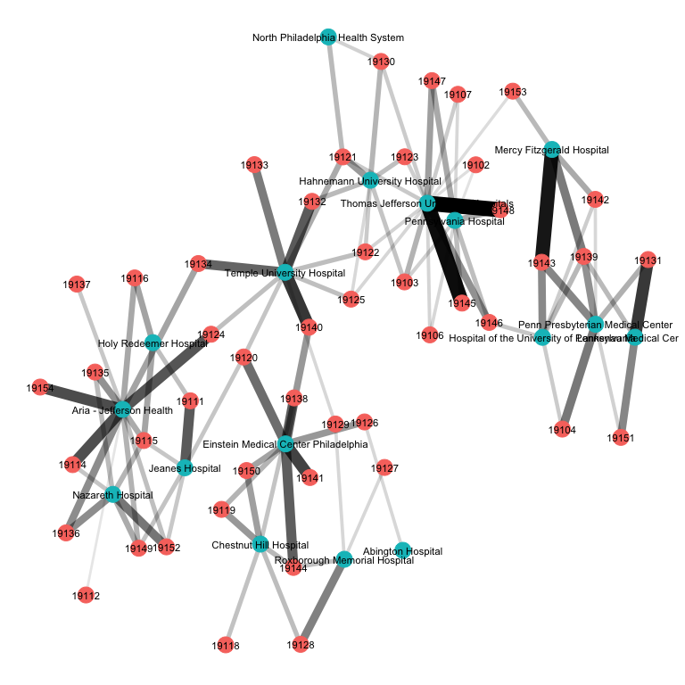
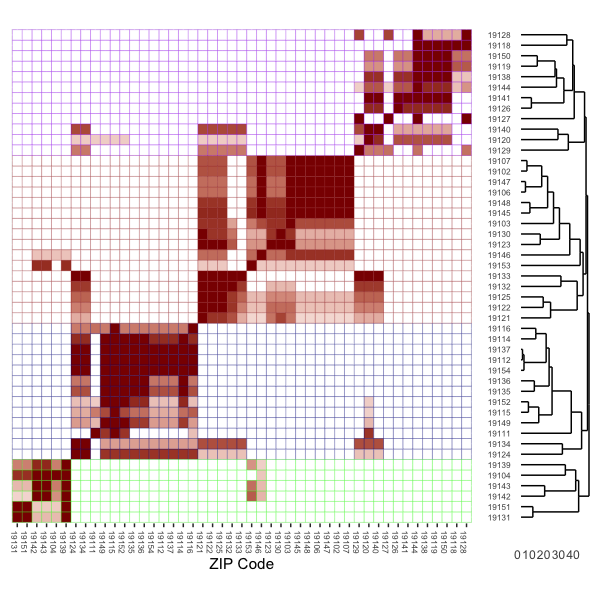
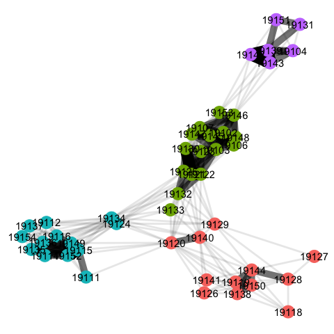

class: inverse, center, middle


<!-- Adjust some CSS code for font size and maintain R code font size -->
<style type="text/css">
.remark-slide-content {
    font-size: 30px;
    padding: 1em 2em 1em 2em;    
}
.remark-code {
  font-size: 15px;
}
.remark-inline-code { 
    font-size: 20px;
}
</style>


<!-- Set R options for how code chunks are displayed and load packages -->
```{r setup, include=FALSE}
options(htmltools.dir.version = FALSE)
library(knitr)
knitr::opts_chunk$set(
  fig.align="center",  
  fig.height=3, #fig.width=6,
  # out.width="748px", #out.length="520.75px",
  dpi=300, #fig.path='Figs/',
  cache=T,# echo=F, warning=F, message=F
  warning = FALSE, 
  message = FALSE, 
  cache.lazy = FALSE,
  error=TRUE
  )

knitr::opts_hooks$set(fig.callout = function(options) {
  if(options$fig.callout) {
    options$echo = FALSE
  }
  options
})

if (!require("pacman")) install.packages("pacman")
pacman::p_load(tidyverse, ggplot2, dplyr, lubridate, readr, readxl, fixest, readstata13,
               xaringanExtra, rdrobust, ggthemes, gganimate, plotly, here, hrbrthemes,
               scales, gapminder, gifski, png, tufte, OECD, ggrepel, dtplyr, data.table, kableExtra, 
               cobalt, haven, magick)
set.seed(1234)
```

```{r xaringan-scribble, echo=FALSE}
xaringanExtra::use_scribble(rgb(0.9, 0.5, 0.5))
```


# Measuring the market

<html><div style='float:left'></div><hr color='#EB811B' size=1px width=1055px></html>

---
# Importance of the market

**Every** analysis of competition requires some definition of the market. This is complicated in healthcare for several reasons:

1. Hospital markets more local than insurance markets
2. Hospitals are multi-product firms
3. Geographic market may differ by procedure
4. Insurance networks limit choice within a geographic market


---
# Hospital Service Areas (HSAs)

1. Begin with town or cities with a hospital (possibly more than one)
2. Assign zip codes to that town/hospital(s) if the plurality of people in that zip code receive care from that town/hospital(s)
3. Define the HSA as all contiguous zip codes from step 2

Around 3,400 HSAs total


---
# Hospital Referral Regions (HRRs)

- Contiguous HSAs
- Population of at least 120,000
- Account for at least 65% of residents' health care services (cardiovascular and neurosurgery)

306 HRRs total

---
# Community Detection

Goal: Identify connected nodes (some geographic region like zip code or county) where residents tend to receive health care services

---
# Community Detection

.pull-left[
1. Form data on geographic units, providers, and patient counts (bipartite)

Matrix with geographic unit as row, provider as columns, and patient counts as cells
]

.pull-right[
```{r echo=FALSE, out.width='85%'}

```
]

---
# Community Detection

.pull-left[
1. Form data on geographic units, providers, and patient counts (bipartite)
2. Convert to matrix on counts of connections (common hospitals) between geographic areas (unipartite)
]

.pull-right[
```{r echo=FALSE, out.width='85%'}

```
]

---
# Community Detection

.pull-left[
1. Form data on geographic units, providers, and patient counts (bipartite)
2. Convert to matrix on counts of connections (common hospitals) between geographic areas (unipartite)
3. Employ cluster walktrap algorithm to identify clusters of geographic units
]

.pull-right[
```{r echo=FALSE, out.width='85%'}

```
]

---
# Cluster Walktrap

What is a "cluster walktrap"?

- Identify densely connected subgraphs (aka communities) 
- Random walk
    - "walker" moves from node to node, uniformly randomly among neighbors
    - "distance" will be large across communities and small within a community
- Algorithm
    - Begin with each node as its own community and calculate distance from each adjacent node
    - Merge two adjacent communities, selected based on minimum sum of squared distances between each node and its community
    - Update distances between communities and repeat


---
class: inverse, center, middle


# Herfindahl-Hirschman Index

<html><div style='float:left'></div><hr color='#EB811B' size=1px width=1055px></html>

---
# HHI

- Basic Cournot framework: $$\pi_{i} = P(q) q_{i} - C_{i}(q_{i})$$
- First order condition: $$P'(q) q_{i} + P(q) - C_{i}'(q) = 0$$

---
# HHI

- Rewriting yields: $$\frac{P(q) - C_{i}'(q_{i})}{P(q)} = \frac{q_{i}}{q} \times \frac{-P'(q)q}{P(q)}=\frac{\alpha_{i}}{\eta}$$
- Constant marginal costs: $$\frac{p - c_{i}}{p} = \frac{\alpha_{i}}{\eta}$$

---
# HHI

- In equilibrium, $$\sum_{i}\pi_{i} = \sum_{i}(p - c_{i}) q_{i} = \sum_{i}(p-c_{i})\alpha_{i} q$$
- Two equivalent expressions
  - $\sum_{i} \pi_{i} = \left(p - \sum_{i} \alpha_{i} c_{i} \right)q$ and
  - $\sum_{i} \pi_{i} = \frac{pq}{\eta} \sum_{i} \alpha_{i}^{2}$ after substituting $p - c_{i} = \alpha_{i} \frac{p}{\eta}$.
  
---
# HHI

- Equating these two expressions yields: $$\frac{p - \sum_{i} \alpha_{i} c_{i}}{q} = \frac{\sum_{i} \alpha_{i}^{2}}{\eta} = \frac{HHI}{\eta}$$
- *Takeaway*: In linear Cournot model with constant marginal costs and homogeneous products, the markup (a common measure of market power) is proportional to the HHI. 


---
class: inverse, center, middle

# Willingness to Pay

<html><div style='float:left'></div><hr color='#EB811B' size=1px width=1055px></html>

---
# WTP

- Alternative measure from Capps et al. (2003)
- Not healthcare specific...option demand market where indermediary sells a "network" of products to consumers, and consumers are uncertain about final products they will need
- **Key**: consumers agree to *ex ante* restrict their choice set before they know what services are needed
- Derivation works backward...

---
# WTP

*Step 1.* Derive *ex post* utility.

\begin{align*}
U_{ij} &= \alpha R_{j} + H_{j}'\Gamma X_{i} + \tau_{1} T_{ij} + \tau_{2} T_{ij} X_{i} + \tau_{3} T_{ij} R_{j} - \gamma(Y_{i},Z_{i}) P_{j}(Z_{i}) + \varepsilon_{ij} \\
 &= U(H_{j},X_{i},\lambda_{i}) - \gamma(X_{i})P_{j}(Z_{i}) + \varepsilon_{ij},
\end{align*}

which yields choice probabilities, $$s_{ij} = s_{j}(G,X_{i},\lambda_{i}) = \frac{\text{exp}(U(H_{j},X_{i},\lambda_{i}))}{\sum_{g\in G}\text{exp}(U(H_{g},X_{i},\lambda_{i}))}.$$

---
# WTP

*Step 2.* Derive utility from access to network, $G$, with $U(H_{g},X_{i},\lambda_{i})$ taken as given.

The patient's expected maximum utility across all hospitals is, $$V(G,X_{i},\lambda_{i}) = \text{E} \left[\max_{g\in G} U(H_{g},X_{i},\lambda_{i}) + \varepsilon_{g} \right] = \text{ln} \left[\sum_{g\in G} \text{exp} (U(H_{g},X_{i},\lambda_{i})) \right].$$

---
# WTP

Contribution of hospital $j$ is then:
\begin{align*}
\triangle V_{j}(G,X_{i},\lambda_{i}) &= V(G,X_{i},\lambda_{i}) - V(G_{-j},X_{i},\lambda_{i}) \\
 &= \text{ln} \left[ \left(\sum_{k\in G_{-j}} \frac{ \text{exp} (U(H_{k},X_{i},\lambda_{i})) }{\sum_{g\in G} \text{exp} (U(H_{g},X_{i},\lambda_{i})) }\right)^{-1} \right] \\
 &= \text{ln} \left[ \left(\sum_{k\in G_{-j}} s_{k}(G,X_{i},\lambda_{i})\right)^{-1} \right] \\
 &= \text{ln} \left[ \left( 1- s_{j}(G,X_{i},\lambda_{i})\right)^{-1} \right].
\end{align*}

---
# WTP

Translate into dollar values by weighting by the marginal utility of price $$\triangle \tilde{W}_{j} = \frac{\triangle V_{j}}{\gamma (X_{i})}.$$


---
# WTP

*Step 3.* Estimate *ex ante* WTP to include hospital $j$ in patient's network. (i.e., integrate over all possible health conditions)

\begin{equation*}
W_{ij}(G,Y_{i},\lambda_{i}) = \int_{Z} \frac{\delta V_{j}(G,X_{i},\lambda_{i})}{\gamma (X_{i})} f(Z_{i}|Y_{i},\lambda_{i}) dZ_{i}.
\end{equation*}
Further integrating over all patients, $(Y_{i},\lambda_{i})$, yields
\begin{equation*}
WTP_{j} = N \int_{\lambda} \int_{Z} \int_{Y} \frac{1}{\gamma (X_{i})} \text{ln}\left[\frac{1}{1-s_{j}(G,X_{i},\lambda_{i})} \right]f(Y_{i},Z_{i},\lambda_{i})dY_{i} dZ_{i} d\lambda_{i}.
\end{equation*}

---
# WTP in Practice

Simplify by calculating WTP for each "micro-market" (e.g., health condition) and taking sum:

$$WTP_{j} = - \sum_{m} N_{m} \text{ln}(1 - s_{mj})$$
