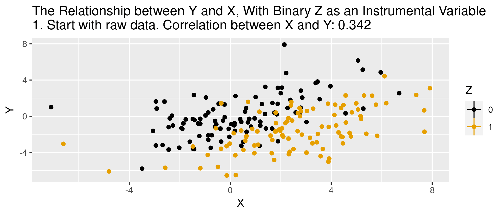

class: inverse, center, middle
name: panel

<!-- Adjust some CSS code for font size and maintain R code font size -->
<style type="text/css">
.remark-slide-content {
    font-size: 30px;
    padding: 1em 2em 1em 2em;    
}
.remark-code {
  font-size: 15px;
}
.remark-inline-code { 
    font-size: 20px;
}
</style>


<!-- Set R options for how code chunks are displayed and load packages -->
```{r setup, include=FALSE}
options(htmltools.dir.version = FALSE)
library(knitr)
knitr::opts_chunk$set(
  fig.align="center",  
  fig.height=3, #fig.width=6,
  # out.width="748px", #out.length="520.75px",
  dpi=300, #fig.path='Figs/',
  cache=T,# echo=F, warning=F, message=F
  warning = FALSE, 
  message = FALSE, 
  cache.lazy = FALSE,
  error=TRUE
  )

knitr::opts_hooks$set(fig.callout = function(options) {
  if(options$fig.callout) {
    options$echo = FALSE
  }
  options
})

if (!require("pacman")) install.packages("pacman")
pacman::p_load(tidyverse, ggplot2, dplyr, lubridate, readr, readxl, fixest, readstata13,
               xaringanExtra, webshot)
set.seed(1234)
```

```{r xaringan-scribble, echo=FALSE}
xaringanExtra::use_scribble(rgb(0.9, 0.5, 0.5))
```

# What is instrumental variables
Instrumental Variables (IV) is a way to identify causal effects using variation in treatment particpation that is due to an *exogenous* variable that is only related to the outcome through treatment.


---
# Why bother with IV?
Two reasons to consider IV:
1. Selection on unobservables (omitted variables bias)
2. Reverse causation

--
<br>

Either problem is sometimes loosely referred to as *endogeneity*

---
# Simple example
- $y = \beta x + \varepsilon (x)$,<br>
where $\varepsilon(x)$ reflects the dependence between our observed variable and the error term.<br>

- Simple OLS will yield<br>
$\frac{dy}{dx} = \beta + \frac{d\varepsilon}{dx} \neq \beta$


---
# What does IV do?
- The regression we want to do: <br>
$y_{i} = \alpha + \delta D_{i} + \gamma A_{i} + \epsilon_{i}$,<br>
where $D_{i}$ is treatment (think of schooling for now) and $A_{i}$ is something like ability.

- $A_{i}$ is unobserved, so instead we run: <br>
$y_{i} = \alpha + \beta D_{i} + \epsilon_{i}$

- From this "short" regression, we don't actually estimate $\delta$. Instead, we get an estimate of<br>
$\beta = \delta + \lambda_{ds}\gamma \neq \delta$,<br>
where $\lambda_{ds}$ is the coefficient of a regression of $A_{i}$ on $D_{i}$. 

---
# Intuition
IV will recover the "long" regression without observing underlying ability<br>

--
<br>

*IF* our IV satisfies all of the necessary assumptions.

---
# More formally
- We want to estimate<br>
$E[Y_{i} | D_{i}=1] - E[Y_{i} | D_{i}=0]$

- With instrument $Z_{i}$ that satisfies relevant assumptions, we can estimate this as<br>
$E[Y_{i} | D_{i}=1] - E[Y_{i} | D_{i}=0] = \frac{E[Y_{i} | Z_{i}=1] - E[Y_{i} | Z_{i}=0]}{E[D_{i} | Z_{i}=1] - E[D_{i} | Z_{i}=0]}$

- In words, this is effect of the instrument on the outcome ("reduced form") divided by the effect of the instrument on treatment ("first stage")

---
# Derivation
Recall "long" regression: $Y=\alpha + \delta S + \gamma A + \epsilon$.

$$\begin{align}
COV(Y,Z) & = E[YZ] - E[Y] E[Z] \\
         & = E[(\alpha + \delta S + \gamma A + \epsilon)\times Z] - E[\alpha + \delta S + \gamma A + \epsilon)]E[Z] \\
         & = \alpha E[Z] + \delta E[SZ] + \gamma E[AZ] + E[\epsilon Z] \\
         & \hspace{.2in} - \alpha E[Z] - \delta E[S]E[Z] - \gamma E[A] E[Z] - E[\epsilon]E[Z] \\
         & = \delta (E[SZ] - E[S] E[Z]) + \gamma (E[AZ] - E[A] E[Z]) \\
         & \hspace{.2in} + E[\epsilon Z] - E[\epsilon] E[Z] \\
         & = \delta C(S,Z) + \gamma C(A,Z) + C(\epsilon, Z)
\end{align}$$

---
# Derivation

Working from $COV(Y,Z) = \delta COV(S,Z) + \gamma COV(A,Z) + COV(\epsilon,Z)$, we find

$$\delta = \frac{COV(Y,Z)}{COV(S,Z)}$$

if $COV(A,Z)=COV(\epsilon, Z)=0$

---
# IVs in practice
Easy to think of in terms of randomized controlled trial...

--
<br>

 Measure    | Offered Seat | Not Offered Seat | Difference 
 ---------- | ------------ | ---------------- | ---------- 
 Score      | -0.003       | -0.358           | 0.355      
 % Enrolled | 0.787        | 0.046            | 0.741   
 Effect     |              |                  | 0.48

<br>

.footnote[
Angrist *et al.*, 2012. "Who Benefits from KIPP?" *Journal of Policy Analysis and Management*.
] 


---
# What is IV *really* doing
Think of IV as two-steps:

1. Isolate variation due to the instrument only (not due to endogenous stuff)
2. Estimate effect on outcome using only this source of variation

---
# In regression terms
Interested in estimating $\delta$ from $y_{i} = \alpha + \beta x_{i} + \delta D_{i} + \varepsilon_{i}$, but $D_{i}$ is endogenous (no pure "selection on observables").

--
<br>

<b>Step 1:</b> With instrument $Z_{i}$, we can regress $D_{i}$ on $Z_{i}$ and $x_{i}$,<br>
$D_{i} = \lambda + \theta Z_{i} + \kappa x_{i} + \nu$,<br>
and form prediction $\hat{D}_{i}$.

--
<br>

<b>Step 2:</b> Regress $y_{i}$ on $x_{i}$ and $\hat{D}_{i}$,<br>
$y_{i} = \alpha + \beta x_{i} + \delta \hat{D}_{i} + \xi_{i}$


---
# Derivation
Recall $\hat{\theta}=\frac{C(Z,S)}{V(Z)}$, or $\hat{\theta}V(Z) = C(Y,Z)$. Then:

$$\begin{align}
\hat{\delta}  & = \frac{COV(Y,Z)}{COV(S,Z)} \\
        & = \frac{\hat{\theta}C(Y,Z)}{\hat{\theta}C(S,Z)} = \frac{\hat{\theta}C(Y,Z)}{\hat{\theta}^{2}V(Z)} \\
        & = \frac{C(\hat{\theta}Z,Y)}{V(\hat{\theta}Z)} = \frac{C(\hat{S},Y)}{V(\hat{S})}
\end{align}$$


---
# Key IV assumptions
1. *Exclusion:* Instrument is uncorrelated with the error term<br>

2. *Validity:* Instrument is correlated with the endogenous variable<br>

3. *Monotonicity:* Treatment more (less) likely for those with higher (lower) values of the instrument<br>

--
<br>

Assumptions 1 and 2 sometimes grouped into an *only through* condition.


---
# Animation for IV
```{r iv-animate, message=FALSE, warning=FALSE, include=FALSE}
df <- data.frame(Z = as.integer(1:200>100),
                 W = rnorm(200)) %>%
  mutate(X = .5+2*W +2*Z+ rnorm(200)) %>%
  mutate(Y = -X + 4*W + 1 + rnorm(200),time="1") %>%
  group_by(Z) %>%
  mutate(mean_X=mean(X),mean_Y=mean(Y),YL=NA,XL=NA) %>%
  ungroup()

#Calculate correlations
before_cor <- paste("1. Start with raw data. Correlation between X and Y: ",round(cor(df$X,df$Y),3),sep='')
afterlab <- '6. Draw a line between the points. The slope is the effect of X on Y.'

dffull <- rbind(
  #Step 1: Raw data only
  df %>% mutate(mean_X=NA,mean_Y=NA,time=before_cor),
  #Step 2: Add x-lines
  df %>% mutate(mean_Y=NA,time='2. Figure out what differences in X are explained by Z'),
  #Step 3: X de-meaned 
  df %>% mutate(X = mean_X,mean_Y=NA,time="3. Remove everything in X not explained by Z"),
  #Step 4: Remove X lines, add Y
  df %>% mutate(X = mean_X,mean_X=NA,time="4. Figure out what differences in Y are explained by Z"),
  #Step 5: Y de-meaned
  df %>% mutate(X = mean_X,Y = mean_Y,mean_X=NA,time="5. Remove everything in Y not explained by Z"),
  #Step 6: Raw demeaned data only
  df %>% mutate(X =  mean_X,Y =mean_Y,mean_X=NA,mean_Y=NA,YL=mean_Y,XL=mean_X,time=afterlab))

#Get line segments
endpts <- df %>%
  group_by(Z) %>%
  summarize(mean_X=mean(mean_X),mean_Y=mean(mean_Y))

p <- ggplot(dffull,aes(y=Y,x=X,color=as.factor(Z)))+geom_point()+
  geom_vline(aes(xintercept=mean_X,color=as.factor(Z)))+
  geom_hline(aes(yintercept=mean_Y,color=as.factor(Z)))+
  guides(color=guide_legend(title="Z"))+
  geom_segment(aes(x=ifelse(time==afterlab,endpts$mean_X[1],NA),
                   y=endpts$mean_Y[1],xend=endpts$mean_X[2],
                   yend=endpts$mean_Y[2]),size=1,color='blue')+
  scale_color_colorblind()+
  labs(title = 'The Relationship between Y and X, With Binary Z as an Instrumental Variable \n{next_state}')+
  transition_states(time,transition_length=c(6,16,6,16,6,6),state_length=c(50,22,12,22,12,50),wrap=FALSE)+
  ease_aes('sine-in-out')+
  exit_fade()+enter_fade()

anim.iv <- animate(p,nframes=175)
anim_save("pics/iv_animate.gif", anim.iv)
```

.center[
  
]

---
# Simulated data
.pull-left[
```{r}
n <- 5000
b.true <- 5.25
iv.dat <- tibble(
  z = rnorm(n,0,2),
  eps = rnorm(n,0,1),
  d = (z + 1.5*eps + rnorm(n,0,1) >0.25),
  y = 2.5 + b.true*d + eps + rnorm(n,0,0.5)
)
```
]

.pull-right[
- endogenous `eps`: affects treatment and outcome
- `z` is an instrument: affects treatment but no direct effect on outcome
]

---
# Results with simulated data
Recall that the *true* treatment effect is `r b.true`
.pull-left[
```{r, echo=FALSE}
summary(lm(y~d, data=iv.dat))
```
]


.pull-right[
```{r, echo=FALSE}
summary(ivreg(y ~ d | z, data=iv.dat))
```
]

---
# Checking instrument
.pull-left[
- Check the 'first stage'
```{r, echo=FALSE}
summary(lm(d~z, data=iv.dat))
```
]

.pull-right[
- Check the 'reduced form'
```{r echo=FALSE}
summary(lm(y~z, data=iv.dat))
```
]


---
# Two-stage equivalence
```{r}
step1 <- lm(d ~ z, data=iv.dat)
d.hat <- predict(step1)
step2 <- lm(y ~ d.hat, data=iv.dat)
summary(step2)
```


---
# Do we need IV?

- Let's run an "augmented regression" to see if our OLS results are sufficiently different than IV

```{r}
d.iv <- lm(d ~ z, data=iv.dat)
d.resid <- residuals(d.iv)
haus.test <- lm(y ~ d + d.resid, data=iv.dat)
summary(haus.test)
```

- Test for significance of `d.resid` suggests OLS is inconsistent in this case


---
# Testing exclusion

- Exclusion restriction says that your instrument does not directly affect your outcome
- Potential testing ideas:
  - "zero-first-stage" (subsample on which you know the instrument does not affect the endogenous variable)
  - augmented regression of reduced-form effect with subset of instruments (overidentified models only)

---
# Testing exogeneity

- Only available in over-identified models
- Sargan or Hansen's J test (null hypothesis is that instruments are correlated with residuals)


---
# Testing strength of instruments

.pull-left[
**Single endogenous variable**
- F-test of instruments (rule of thumb critical value of 10)
- Partial $R^2$
]

.pull-right[
**Many endogenous variables**
- More complicated
]

---
# Why we care about instrument strength

Recall our schooling and wages equation, $$y = \beta S + \epsilon$$. Bias in IV can be represented as:

$$Bias_{IV} \approx \frac{Cov(S, \epsilon)}{V(S)} \frac{1}{F+1} = Bias_{OLS} \frac{1}{F+1}$$

- Bias in IV may be close to OLS, depending on instrument strength
- **Bigger problem:** Bias could be bigger than OLS if exclusion restriction not *fully* satisfied
- Over-reliance on "rules of thumb", as seen in [Anders and Kasy (2019)](https://www.aeaweb.org/articles?id=10.1257/aer.20180310)


---
# LATE and IV Interpretation

- With monotonicity assumption (all those affected by the instrument are affected in the same "direction")
- In the face of **heterogeneous treatment effects**, IV provides a "Local Average Treatment Effect"
- LATE: Effect of treatment among those affected by the instrument (compliers only)
- Why does this matter? Let's discuss Medicaid expansion in Oregon

