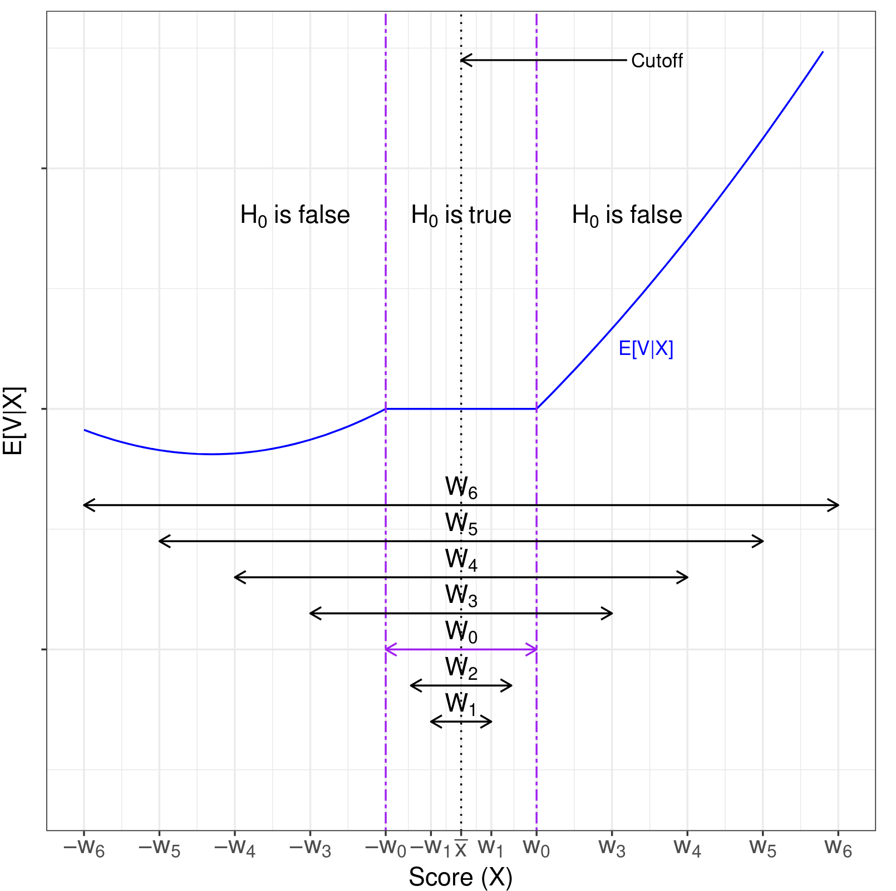
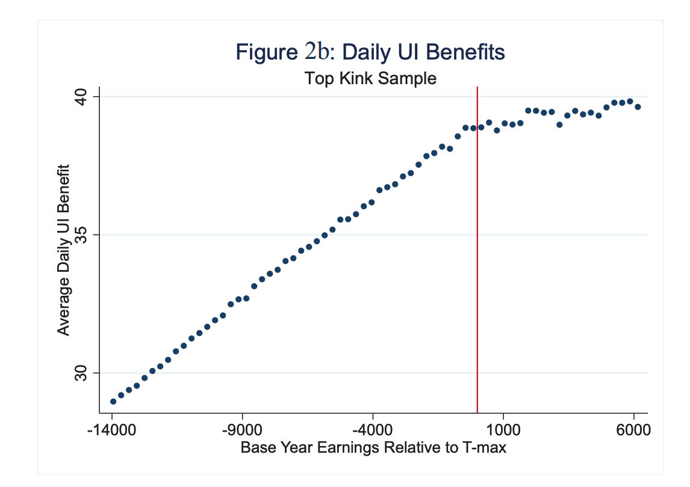
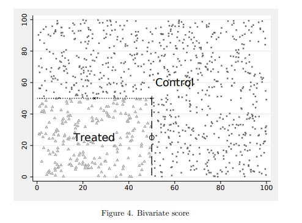

class: inverse, center, middle


<!-- Adjust some CSS code for font size and maintain R code font size -->
<style type="text/css">
.remark-slide-content {
    font-size: 30px;
    padding: 1em 2em 1em 2em;    
}
.remark-code {
  font-size: 15px;
}
.remark-inline-code { 
    font-size: 20px;
}
</style>


<!-- Set R options for how code chunks are displayed and load packages -->
```{r setup, include=FALSE}
options(htmltools.dir.version = FALSE)
library(knitr)
knitr::opts_chunk$set(
  fig.align="center",  
  fig.height=3, #fig.width=6,
  # out.width="748px", #out.length="520.75px",
  dpi=300, #fig.path='Figs/',
  cache=T,# echo=F, warning=F, message=F
  warning = FALSE, 
  message = FALSE, 
  cache.lazy = FALSE,
  error=TRUE
  )

knitr::opts_hooks$set(fig.callout = function(options) {
  if(options$fig.callout) {
    options$echo = FALSE
  }
  options
})

if (!require("pacman")) install.packages("pacman")
pacman::p_load(tidyverse, ggplot2, dplyr, lubridate, readr, readxl, fixest, readstata13,
               xaringanExtra, webshotm, ggthemes, gganimate, plotly, ivpack, ivreg)
set.seed(1234)
```

```{r xaringan-scribble, echo=FALSE}
xaringanExtra::use_scribble(rgb(0.9, 0.5, 0.5))
```


# RD with Discrete Running Variable

<html><div style='float:left'></div><hr color='#EB811B' size=1px width=1055px></html>

---
# Discrete Running Variables

- With lots of mass points, not a problem
- With sufficiently few mass points...
- Standard smoothness/continuity argument no longer applies
- Need to assume that observations are as good as randomly assigned above/below threshold (Local Randomization)

---
# Local randomization versus continuity

- Often used as heuristic device in continuous running variable RD
- Requires stronger assumptions than continuity-based RD
    - Continuity-based RD allows for running variable to directly affect potential outcomes
    - Local randomization instead assumes $x_{i}$ is randomly generated and independent of $Y_{i}(1)$ and $Y_{i}(0)$:
    
$$\small E[Y_{i} | x_{i} \geq c] - E[Y_{i} | x_{i}<c] = E[Y_{i}(1) | x_{i}\geq c] - E[Y_{i}(0)|x_{i}<c] = E[Y_{i}(1)] - E[Y_{i}(0)]$$

---
# Local randomization versus continuity

- Practical rephrasing...regression of $y$ on $x$ should have zero slope (pretty strong)
- "Regression functions are constant in the entire region where the score is randomly assigned"
- Possible to weaken this and impose assumption on some transformed potential outcome, for known transformation

---
# Local randomization and inference

- Large sample approximation may be invalid if number of observations in bandwidth is small
- Turn to randomization-based inference (`rdrandinf`)

---
# Local randomization and bandwidth

- Can still select "optimal" bandwidth or window around the threshold, but harder to do
- Cattaneo et al (2020) suggest using covariates known to be correlated with the outcome and the running variable
- Find largest window where this correlation is no different from 0 (`rdwinselect`)

---
class: clear

.center[
```{r echo=FALSE, out.width='50%'}

```
]

---
# Local randomization and bandwidth

With few mass points

- Minimum window is "interval between two consecutive mass points where the treatment status changes from zero to one"
- Only need to use two mass points
- Actual value of cutoff is meaningless since running variable is discrete

---
# Discrete running variable in practice

- `rdrobust` has some adjustments for mass points and unique values
- `rdrandinf` for randomization inference with discrete running variable
- `rdwinselect` for optimal window (using covariate argument previously)
- Kolesar and Rothe (2018), `RDHonest`
    - Approximates bias due to larger-than-ideal bandwidth
    - Assume maximum bias, construct adjusted CI

---
class: inverse, center, middle

# Regression Kink

<html><div style='float:left'></div><hr color='#EB811B' size=1px width=1055px></html>

---
# RD as a kink

Some discontinuities are just in the slope rather than the intercept:

.center[
```{r echo=FALSE, out.width='50%'}

```
]

---
# RD as a kink

- Highly applicable
- Challenging to implement as it requires a lot of data
    - Slopes are hard to disentangle in raw data
    - Ganong and Jager (2020) JASA offer a possible test
- Implemented with `rdrobust` and `deriv=1` option
- Fuzzy Kink RD...with `rdrobust` and `deriv=1` and `fuzzy=t` options

---
class: inverse, center, middle

# RD with Multiple Cutoffs

<html><div style='float:left'></div><hr color='#EB811B' size=1px width=1055px></html>

---
# Different types of mutliple cutoffs

- Noncumulative: Cutoff values differ across groups, but each group has only one cutoff (e.g., test scores with different thresholds across schools)
- Cumulative: one common score system for each person, but different treatments along the running variable (e.g., treatment 1 at age 60 and treatment 2 at age 65)
- Multiple scores: Units receive two scores and treatment is assigned based on a boundary for both scores (e.g., geographic boundary with latitude and longitude)
- Implemented with `rdmulti` in Stata and R


---
# Noncumulative

- Nothing new here
- Just apply standard RD to pooled sample with re-centered running variable, $\tilde{x} = x - c$


---
# Cumulative

- Receive treatment 1 if $x_{i} < c_{1}$, treatment 2 if $c_{1} \leq x_{i} < c_{2}$, etc.
- Problematic if person $i$ is in multiple bandwidths
- Choose bandwidths to ensure non-overlapping populations around each threshold
- Can pool the estimates once non-overlapping windows are ensured

---
# Multiple scores

- Applies to "geographic" RD

.center[
```{r echo=FALSE, out.width='50%'}

```
]

---
class: inverse, center, middle

# Bias and Undersmoothing

<html><div style='float:left'></div><hr color='#EB811B' size=1px width=1055px></html>


---
# Asymptotic distribution

From Cattaneo et al. (2020):
$$\text{MSE}(\hat{\tau}_{SRD}) = \text{Bias}^{2}(\hat{\tau}_{SRD}) + \text{Var}(\hat{\tau}_{SRD}) = (h^{2(p+1)}\mathcal{B})^{2} + \frac{1}{nh}\mathcal{V}$$
- $p$ is the polynomial degree of the local linear estimator ($p=1$ for linear)
- $\mathcal{B}$ is the leading bias term of an expansion 
- $\mathcal{V}$ is the leading variance term


---
# Asymptotic distribution

Choice of $h$ that minimizes this MSE (conditional on $p$ and the kernel) is:
$$h_{MSE} = \left(\frac{\mathcal{V}}{2(p+1)\mathcal{B}^{2}}\right)^{1/(2p+3)}n^{-1/(2p+3)}$$

- for $p = 1$, $o(h_{MSE}) = n^{-1/5}$
- but choosing $h_{MSE} \propto  n^{-1/5}$ does not lead to zero bias because bias reduces to zero at slower rate


---
# Asymptotic distribution

- Calonico, Cattaneo, and Titunik (2015) argues for plug-in estimator for bias
- Idea: 
    - Estimate local RD estimate with quadratic terms
    - Use second derivative to approximate bias for the local linear RD
    - Adjust resulting local linear RD
- Calonico, Cattaneo, and Farrell (2020) argues for CE-optimal bandwidths